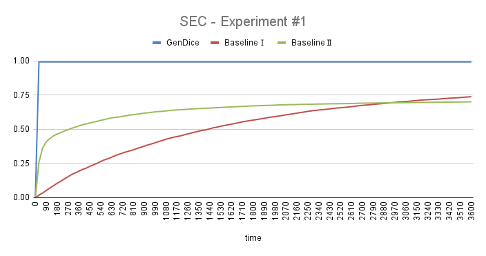

# GenDice:  Efficient Test Generation for Deep Learning Compilers 

Source code and other supplemental materials  for "GenDice:  Efficient Test Generation for Deep Learning Compilers". 


## Requirements

- Python 3
- numpy==1.21.1
- onnx==1.8.0
- tvm
- onnxruntime==1.6.0
- netron==5.1.4
- xlwt==1.3.0

For the installation of **tvm**, please see [here](https://github.com/apache/tvm). 


## Usage

```
# for GenDice generation
timeout (time) python gen.py --minnode MINNODE --maxnode MAXNODE --pickrate pickExisRate --file (name of file that contains results) 
# eg: timeout 900s python gen.py --minnode 1 --maxnode 30 --pickrate 0.95 --file result_dice_e{i}.txt"

# for baseline 1 purely random generation 
timeout (time) python gen.py --minnode MINNODE --maxnode MAXNODE --pickrate pickExisRate --file filename 

# for baseline 2 random generation with incremental generation
timeout (time) python gen.py --minnode MINNODE --maxnode MAXNODE --pickrate pickExisRate --file filename

# write the results into excels 
cd results
python table.py --interval time_interval --total total_time --ispk (1 for experiment with baselines; 0 for experiment of pickrate) --paths (names of files need to be processed) --types (different approaches) --case (different settings of parameters) --iter 5
#eg: 
# python table.py --interval 30 --total 900 --ispk 0 --paths result_dice_e result_rand_e result_winc_e --types dice purerand winc --case _10_10_0.95 --iter 5
# python table.py --interval 30 --total 900 --ispk 1 --paths result_dice_e --types dice --case _1_30_0.5 _1_30_0.8 _1_30_0.9 _1_30_0.95 _1_30_0.98 _1_30_0.99 --iter 5

```


## Semantic Specification of Deep Learning Models

In deep learning, a computation graph is defined as a directed graph that comprises nodes and edges. Each node denotes a mathematical operation. Each edge describes a tensor that gets transferred between nodes. Computation graph is a suitable level of representation for deep learning model, considering that APIs are too high-level and hardware languages are too low-level.

Nodes on computation graph define mathematical operations on their related edges which are the input and output tensor(s) of the operation. Explicit forms of arithmetical expression of operations indicate the semantic specification of the operation (i.e., the constraints between the attributes of tensors).

In order to better model those constraints from operations, we categorize the operations into three types and describe their features respectively, as shown in the table below. Some of the operations may belong to more than one category. 

| Number | Operation Name  |               Type               |                          Parameters                          |
| :----: | :-------------: | :------------------------------: | :----------------------------------------------------------: |
|   1    |    Identity     |            *identity*            |                             None                             |
|   2    |       Abs       |            *identity*            |                             None                             |
|   3    |       Neg       |            *identity*            |                             None                             |
|   4    |   Reciprocal    |            *identity*            |                             None                             |
|   5    |      Floor      |            *identity*            |                             None                             |
|   6    |      Ceil       |            *identity*            |                             None                             |
|   7    |      Round      |            *identity*            |                             None                             |
|   8    |       Erf       |            *identity*            |                             None                             |
|   9    |      Sign       |            *identity*            |                             None                             |
|   10   |       Exp       |            *identity*            |                             None                             |
|   11   |    Softsign     |            *identity*            |                             None                             |
|   12   |     Softmax     |            *identity*            |                             axis                             |
|   13   |     Sigmoid     |            *identity*            |                             None                             |
|   14   |   HardSigmoid   |            *identity*            |                         alpha, beta                          |
|   15   |      Relu       |            *identity*            |                             None                             |
|   16   |    LeakyRelu    |            *identity*            |                            alpha                             |
|   17   |      Selu       |            *identity*            |                         alpha, gamma                         |
|   18   |       Sin       |            *identity*            |                             None                             |
|   19   |       Cos       |            *identity*            |                             None                             |
|   20   |      Sqrt       |            *identity*            |                             None                             |
|   21   |      PRelu      |          *multi-inputs*          |                             None                             |
|   22   |     Flatten     |          *multi-inputs*          |                             axis                             |
|   23   |       Add       |          *multi-inputs*          |                             None                             |
|   24   |       Sub       |          *multi-inputs*          |                             None                             |
|   25   |       Mul       |          *multi-inputs*          |                             None                             |
|   26   |       Div       |          *multi-inputs*          |                             None                             |
|   27   |       Sum       |          *multi-inputs*          |                             None                             |
|   28   |       Max       |          *multi-inputs*          |                             None                             |
|   29   |       Min       |          *multi-inputs*          |                             None                             |
|   30   |      Mean       |          *multi-inputs*          |                             None                             |
|   31   |     MaxPool     |          *multi-inputs*          | auto\_pad, ceil\_mode, dilations, kernel\_shape, pads, storage\_order, strides |
|   32   |   AveragePool   |          *multi-inputs*          | auto\_pad, ceil\_mode, count\_include\_pad, dilations, kernel\_shape, pads, strides |
|   33   |     LpPool      |          *multi-inputs*          |          auto\_pad, kernel\_shape, p, pads, strides          |
|   34   |      Conv       |          *multi-inputs*          |  auto\_pad, dilations, group, kernel\_shape, pads, strides   |
|   35   |     MatMul      |          *multi-inputs*          |                             None                             |
|   36   |      Gemm       |          *multi-inputs*          |                 alpha, beta, transA, transB                  |
|   37   |     Concat      | *multi-inputs*, *shape-changing* |                             axis                             |
|   38   |  SpaceToDepth   |         *shape-changing*         |                       blocksize, mode                        |
|   39   |    ReduceMax    |         *shape-changing*         |                        axes, keepdims                        |
|   40   |   ReduceMean    |         *shape-changing*         |                        axes, keepdims                        |
|   41   |    ReduceMin    |         *shape-changing*         |                        axes, keepdims                        |
|   42   |   ReduceProd    |         *shape-changing*         |                        axes, keepdims                        |
|   43   | ReduceSumSquare |         *shape-changing*         |                        axes, keepdims                        |
|   44   |    ReduceL1     |         *shape-changing*         |                        axes, keepdims                        |
|   45   |    ReduceL2     |         *shape-changing*         |                        axes, keepdims                        |
|   46   | ReduceLogSumExp |         *shape-changing*         |                        axes, keepdims                        |

The first type is called *identity* operation (e.g., `Absolute` operation, `Exponential` operation). It means that the shape of the input tensor is the same as the shape of the output tensor. For example, `Softmax` operation will take a single tensor and an integer parameter as the input. The integer parameter is named  which defines the dimension that `Softmax` operation will be performed on. 

The second type is *multi-inputs* operation (e.g., `Add` operation, `Sub` operation). It means that the input of the operation requires multiple tensors. For example, `Add` operation takes two or more tensors as input and performs element-wise binary addition with them. We use $a_i$ to denote the length of i-th dimension in tensor $A$, and take two tensors as the input as the example:
$$
C_{i_1, i_2, ... i_n} = A_{i_1, i_2, ... i_n} + B_{i_1, i_2, ... i_n}, \forall i_1 \in [1, a_1], ..., i_n \in [1, a_n]
$$
The mathematic expression of addition naturally implies a semantic constraint between the inputs: the shape of tensor $A$, $B$, and $C$ should be same ($dim(A)$ denotes the dimension of tensor $A$):
$$
dim(A) = dim(B) = dim(C)\ and\ a_i = b_i = c_i, \forall i \in [1, dim(A)]
$$
The third type is *shape-changing* operations (e.g., `ReduceMax` operation, `Pooling` operation, `Conv` operation. The shape of output tensors will change along with input tensors. Take the `Concat` operation as an example, it takes a list of tensors into a single tensor with a parameter axis that defines the dimension to concatenate on (also take two tensors as input as the example):
$$
C_{i_1, i_2, i_{axis-1}, k, i_{axis+1} ... i_n} = A_{i_1, i_2, i_{axis-1}, k, i_{axis+1} ... i_n}, \forall k \in [1, a_{axis}]
$$

$$
C_{i_1, i_2, i_{axis-1}, k, i_{axis+1} ... i_n} = B_{i_1, i_2, i_{axis-1}, k - a_{axis}, i_{axis+1} ... i_n}, otherwise
$$

The specification of `Concat` operation is as follows: all input tensors will have the same shape, except for the length of axis-th dimension; and for the axis-th dimension which input tensors concatenate on, the output tensor's length of that dimension will equal to the sum of input tensors':
$$
dim(A) = dim(B) = dim(C)
$$

$$
c_i = a_i = b_i, \forall i \in [1, dim(A)] \ and\ i \neq axis
$$

$$
c_i = a_i + b_i, i = axis 
$$


## Metrics

To better present the efficiency of our generated models, we draw different metrics to measure our performance. We design 12 types of metrics in total. It contains two parts: graph-level metrics and operation-level metrics. We put forward graph-level metrics ourselves by analogy concepts in structural code coverage and combinatorial test. For operation-level metrics, we mainly follow the work by [Luo etc.](https://arxiv.org/pdf/2008.05933.pdf) They are listed below:

- **Graph-level Metrics**
  - Number of Operations (NOO)
  - Number of Operation Types (NOT)
  - Number of Operation Pairs (NOP)
  - Number of Shapes and Parameters (NSP)
  - Number of Tensor Paths (NTP)
  - Max Length of Paths (MLP)
  - Average Length of Paths (ALP)
- **Operation-level Metrics**
  - Operation Type Coverage (OTC)
  - Input Degree Coverage (IDC)
  - Output Degree Coverage (ODC)
  - Single Edge Coverage (SEC)
  - Shapes and Parameters Coverage (SPC)

## Experiments and Results

We conducted 3 experiments to evaluate the efficiency of GenDice, comparing with two baselines. Also, we run 1 experiment to compare the results of different values of the parameter *pickTensorThreshold*. 

**baselines**: The first baseline is purely random generation, also called 'whole generation with checking', whose relative results have a name of 'purerand'. The second baseline is also based on random generation but with incremental generation, called 'incremental construction by checking', whose relative results have a name of 'withinc'/'winc'. The results of GenDice have a name of 'dice'.

**common settings**: For each of the experiments, we set a fixed time limitation as 15 minutes and run GenDice and baselines (or other settings of *pickTensorThreshold*) separately. We measure the results based on the metrics we raised. 

### #1. Generate models of multiple sizes in a fixed time duration, compared with other baselines

**settings**: In experiment #1, we choose the lowerbound of operation number as 1, upperbound of operation number as 30, upperbound of tensor's dimension as 5, upperbound of each dimension's length as 5, and upperbound of input tensor degrees for operations with infinite possible input degrees as 5. The *pickTensorThreshold* is 0.95. 

#### results:

The results of metrics of GenDice and other 2 baselines are presented in the table below:

|           |                 |       GenDice | Baseline1 |  Baseline2 |
| :-------: | :-------------: | ------------: | --------: | ---------: |
|           | \# valid models |   **40819.0** |     525.6 |     6593.4 |
|           |                 |               |           |            |
|           |       OTC       |      **100%** |    98.70% |     96.09% |
| operation |       IDC       |      **100%** |    97.52% |     94.61% |
|   level   |       ODC       |   **11.2652** |    2.5739 |     3.1956 |
|  metrics  |       SEC       |    **99.29%** |    21.42% |     57.38% |
|           |       SPC       | **2830.8480** |   22.7739 |    81.1870 |
|           |                 |               |           |            |
|           |       NOO       |      15.49442 |    2.1626 |    15.5018 |
|           |       NOT       |   **12.6814** |    2.0856 |    11.3909 |
|   graph   |       NOP       |   **13.2941** |    1.0141 |     2.5397 |
|   level   |       NSP       |        5.4114 |    1.2147 | **6.2904** |
|  metrics  |       NTP       |   **25.7758** |    2.5457 |    14.3949 |
|           |       MLP       |    **4.2735** |    1.7097 |     2.0959 |
|           |       ALP       |    **2.7062** |    1.5170 |     1.0964 |

We also present figures of the increase of operation-level metrics over time. 





The distributions of different operators in GenDice and two baselines are shown in the following fig:


### #2. Generate models of multiple sizes in a fixed time duration, with different settings of *pickTensorThreshold*

**settings**: In experiment #2, we set the parameters except *pickTensorThreshold* the same as experiment #1, while the *pickTensorThreshold* varies among a range of [0.5, 0.8, 0.9, 0.95, 0.98, 0.99]. Note that we only evaluate GenDice in this experiment.

#### results:

The results of metrics of different *pickTensorThreshold* values are presented in the table below:

|                 |     values      |         0.5 |      0.8 |      0.9 |         0.95 |     0.98 |        0.99 |
| :-------------: | :-------------: | ----------: | -------: | -------: | -----------: | -------: | ----------: |
|                 | \# valid models |     37115.0 |  39281.0 |  39529.6 |  **40819.0** |  40098.2 |     40067.6 |
|                 |                 |             |          |          |              |          |             |
|                 |       OTC       |        100% |     100% |     100% |     **100%** |     100% |        100% |
| operation-level |       IDC       |        100% |     100% |     100% |     **100%** |     100% |        100% |
|     metrics     |       ODC       |      7.8043 |  10.2522 |  10.8522 |  **11.2652** |  11.3174 | **11.4652** |
|                 |       SEC       |      99.29% |   99.29% |   99.29% |   **99.29%** |   99.29% |      99.29% |
|                 |       SPC       |    2732.630 | 2800.143 | 2797.665 | **2830.848** | 2785.157 |    2783.222 |
|                 |                 |             |          |          |              |          |             |
|                 |       NOO       |     15.5131 |  15.5041 |  15.4946 |  **15.4944** |  15.4731 |     15.4972 |
|                 |       NOT       |     12.6935 |  12.6854 |  12.6754 |  **12.6814** |  12.6619 |     12.6876 |
|   graph-level   |       NOP       |      6.4690 |  10.8292 |  12.4428 |  **13.2941** |  13.7868 | **13.9863** |
|     metrics     |       NSP       | **11.0360** |   7.3798 |   6.0827 |   **5.4114** |   5.0267 |      4.8915 |
|                 |       NTP       |     20.7253 |  22.7890 |  24.5259 |  **25.7758** |  26.4883 | **26.8589** |
|                 |       MLP       |      2.9260 |   3.7996 |   4.1091 |   **4.2735** |   4.3686 |  **4.4075** |
|                 |       ALP       |      1.5696 |   2.2499 |   2.5440 |   **2.7062** |   2.8046 |  **2.8423** |


### #3.  Generate models of fixed small size in a fixed time duration, compared with other baselines

**settings**: In experiment #3, we set the parameters except the operation number of a model the same as experiment #1, while the operation number is fixed as 10. 

#### results:

The results of metrics of GenDice and other 2 baselines are presented in the table below:

|           |                 |       GenDice |  Baseline1 | Baseline2 |
| :-------: | :-------------: | ------------: | ---------: | --------: |
|           | \# valid models |   **42223.4** |       63.6 |    9263.8 |
|           |                 |               |            |           |
|           |       OTC       |      **100%** |     96.52% |    96.09% |
| operation |       IDC       |      **100%** |     95.26% |    95.31% |
|   level   |       ODC       |    **9.6957** |     2.8739 |    3.0217 |
|  metrics  |       SEC       |    **99.29%** |     20.99% |    58.64% |
|           |       SPC       | **2315.3652** |    14.6000 |   78.8391 |
|           |                 |               |            |           |
|           |       NOO       |            10 |         10 |        10 |
|           |       NOT       |    **9.0788** |     9.0094 |    8.5968 |
|   graph   |       NOP       |        7.3817 | **8.4471** |    1.5323 |
|   level   |       NSP       |    **4.0571** |     2.4145 |    5.2717 |
|  metrics  |       NTP       |   **14.2139** |    12.7480 |    9.6858 |
|           |       MLP       |        3.7878 | **4.2524** |    1.9519 |
|           |       ALP       |       2.49572 | **2.7993** |    1.1099 |

The figures of the increase of operation-level metrics over time are as follows:


The distributions of different operators in GenDice and two baselines are shown in the following fig:


### #4. Generate models of fixed large size in a fixed time duration, compared with other baselines

**settings**: In experiment #4, we set the parameters except the operation number the same as experiment #1, while the operation number is fixed as 100. 

#### results:

We found that Baseline 1 fails to generate any model of size 100 in the duration of 15 minutes. So results for  Baseline 1 are replaced by 'timeout'.

The results of metrics of GenDice and other 2 baselines are presented in the table below:

|                 |                 |       GenDice | Baseline1 | Baseline2 |
| :-------------: | :-------------: | ------------: | --------: | --------: |
|                 | \# valid models |   **11099.0** |         0 |     998.8 |
|                 |                 |               |           |           |
|                 |       OTC       |      **100%** |   timeout |    0.9565 |
| operation-level |       IDC       |      **100%** |   timeout |    0.9104 |
|     metrics     |       ODC       |   **13.7391** |   timeout |    3.2913 |
|                 |       SEC       |    **99.29%** |   timeout |   0.53846 |
|                 |       SPC       | **3577.5480** |   timeout |  77.28694 |
|                 |                 |               |           |           |
|                 |       NOO       |           100 |       100 |       100 |
|                 |       NOT       |   **40.8964** |   timeout |  28.54542 |
|   graph-level   |       NOP       |  **105.8384** |   timeout |  18.02338 |
|     metrics     |       NSP       |   **22.5433** |   timeout |  18.32588 |
|                 |       NTP       |  **269.4645** |   timeout |  86.66808 |
|                 |       MLP       |    **8.8227** |   timeout |   3.39168 |
|                 |       ALP       |    **4.7611** |   timeout |   1.22058 |

The figures of the increase of operation-level metrics over time are as follows:


The distributions of different operators in GenDice and two baselines are shown in the following fig:


## Bug Details

The table below contains bugs we have detected.

All of the bugs are listed and discussed in this section.

### Bugs on TVM/ONNX Runtime.
After finding bugs on TVM and ONNX Runtime, we reported them to the corresponding compiler developers. 

The table below contains bugs we have detected on TVM and ONNX Runtime.


For the details of the bugs, please check *bugs.zip*.

#1 (duplicate with #2) It is an error bug on the backend. There is a pass named DynamicToStatic which should not be defined at level 3. It will lead the internal error when the deep learning model contains operations such as MatMul, Dropout. After our reporting, developers reordered dynamic to static and simplify inference, lower DynamicToStatic optimization level to fix it.

#3 (duplicate with #4) It is an error bug on the frontend. The developer from TVM has explained the cause of the bug and fixed it: “It’s due to a bad assumption made in PRelu conversion about the input layout......Our current PRelu converter assumes that incoming data is in NCHW format and that the slope will have C total elements. Neither of these are actual requirements for ONNX PReLu.”

#5 and #6 These are error bugs on the frontend. It is because that the parameters of operations in ONNX allow default value while this is not supported in TVM.

#7 It is an error bug on the backend. This bug is related to Gemm operator. It catches an edge case of the Relay’s type checker (Relay is the intermediate representation of TVM).

#8 It is an error bug on the frontend. It is because that the matrix C in Gemm operation can be optional by ONNX specification but the TVM doesn’t allow that behavior.

#9 and #10 These are error bugs on the frontend due to the inconsistent specifications between different ONNX versions on some of operations, causing the error on TVM’s frontend.

#11 This is a wrong-result bug on the backend. The result is inconsistent between TVM and ONNX Runtime on a generated model containing Flatten and ReduceL1 operation. This bug has not been confirmed by developers yet.

#12 This is a wrong-result bug on the backend. The way of LpPool operation’ calculation in ONNX Runtime is inconsistent with many other deep learning engines like TVM, PyTorch.

### Bugs on the compiler named AnonymousX.

Besides two opensource deep learning compilers, we also conduct GenDice on a commercial deep learning compiler from the company AnonymousX.

It turns out 7 bugs, the details are listed as follows. We do not provide with the reproducible package for bugs on the compiler named AnonymousX due to the reason of anonymous reviewing.

#1 It is an error bug on the frontend. Compiler does not support that the weight tensor of 𝐶𝑜𝑛𝑣 operation is an input tensor. Developer do not fix this bug due to the reason that they suppose users take this parameter as a constant because this parameter usually does not change after deployment.

#2 It is an error bug on the backend. If the inputs of 𝑀𝑒𝑎𝑛 operation are the same tensor, then the calculation of mean operation will throw exception due to the naming error. It has already been fixed by developers.

#3 It is an error bug on the backend. 𝑅𝑒𝑑𝑢𝑐𝑒𝑃𝑟𝑜𝑑 operation will register a buffer, but buffer size has not been assigned which leads to the incorrect parameters in calculation and further causes the final result wrong. It has already been fixed by developers.

#4 It is an error bug on the frontend. Compiler frontend does not parse correctly for 𝑃𝑜𝑜𝑙𝑖𝑛𝑔 operation. It has already been fixed by developers.

#5 It is an error bug on the backend. ONNX standard has changed after version 13. The compiler only implements old version and is not compatible with latest standard. It has already been fixed by developers.

#6 It is an error bug on the backend. Compiler assumes the second input of 𝑃𝑅𝑒𝑙𝑢 holds a specific shape which is not consistent with ONNX standard.

#7 It is a wrong-result bug on the backend. Compiler backend incorrectly covers the input data for the calculation on 𝐶𝑜𝑠 operation. It has already been fixed by developers.
