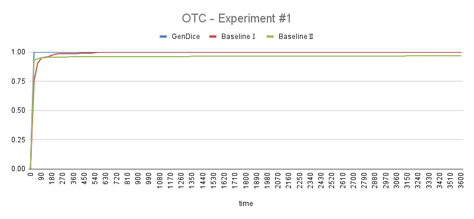

# GenDice:  Efficient Test Generation for Deep Learning Compilers 

Source code and other supplemental materials  for "GenDice:  Efficient Test Generation for Deep Learning Compilers". 


## Requirements

- Python 3
- numpy==1.21.1
- onnx==1.8.0
- tvm
- onnxruntime==1.6.0
- netron==5.1.4
- xlwt==1.3.0


For the installation of **tvm**, please see [here](https://github.com/apache/tvm). 


## Usage

```
# for GenDice generation
timeout (time) python gen.py --minnode MINNODE --maxnode MAXNODE --pickrate pickExisRate --file (name of file that contains results) 
# eg: timeout 900s python gen.py --minnode 1 --maxnode 30 --pickrate 0.95 --file result_dice_e{i}.txt"

# for baseline 1 purely random generation 
timeout (time) python gen.py --minnode MINNODE --maxnode MAXNODE --pickrate pickExisRate --file filename 

# for baseline 2 random generation with incremental generation
timeout (time) python gen.py --minnode MINNODE --maxnode MAXNODE --pickrate pickExisRate --file filename

# write the results into excels 
python table.py --interval time_interval --total total_time --ispk (1 for experiment with baselines; 0 for experiment of pickrate) --paths (names of files need to be processed) --types (different approaches) --case (different settings of parameters) --iter 5
#eg: 
# python table.py --interval 30 --total 900 --ispk 0 --paths result_dice_e result_rand_e result_winc_e --types dice purerand winc --case _10_10_0.95 --iter 5
# python table.py --interval 30 --total 900 --ispk 1 --paths result_dice_e --types dice --case _1_30_0.5 _1_30_0.8 _1_30_0.9 _1_30_0.95 _1_30_0.98 _1_30_0.99 --iter 5

```


## Metrics

To better present the efficiency of our generated models, we draw different metrics to measure our performance. We design 12 types of metrics in total. It contains two parts: graph-level metrics and operation-level metrics. We put forward graph-level metrics ourselves by analogy concepts in structural code coverage and combinatorial test. For operation-level metrics, we mainly follow the work by [Luo etc.](https://arxiv.org/pdf/2008.05933.pdf) They are listed below:

- **Graph-level Metrics**
  - Number of Operations (NOO)
  - Number of Operation Types (NOT)
  - Number of Operation Pairs (NOP)
  - Number of Shapes and Parameters (NSP)
  - Number of Tensor Paths (NTP)
  - Max Length of Paths (MLP)
  - Average Length of Paths (ALP)
- **Operation-level Metrics**
  - Operation Type Coverage (OTC)
  - Input Degree Coverage (IDC)
  - Output Degree Coverage (ODC)
  - Single Edge Coverage (SEC)
  - Shapes and Parameters Coverage (SPC)

## Experiments and Results

We conducted 3 experiments to evaluate the efficiency of our approach, comparing with two baselines. Also, we run 1 experiment to compare the results of different values of the parameter *pickTensorThreshold*. 

**baselines**: The first baseline is purely random generation, whose relative results have a name of 'purerand'. The second baseline is also based on random generation but with incremental generation, whose relative results have a name of 'withinc'/'winc'. The results of our approach have a name of 'dice'.

**common settings**: For each of the experiments, we set a fixed time limitation as 15 minutes and run our approach and baselines (or other settings of *pickTensorThreshold*) separately. We measure the results based on the metrics we raised. 

### #1. Generate models of multiple sizes in a fixed time duration, compared with other baselines

**settings**: In experiment #1, we choose the lowerbound of operation number as 1, upperbound of operation number as 30, upperbound of tensor's dimension as 5, upperbound of each dimension's length as 5, and upperbound of input tensor degrees for operations with infinite possible input degrees as 5. The *pickTensorThreshold* is 0.95. 

#### results:

The results of metrics of our approach and other 2 baselines are presented in the table below:

|           |                 |       GenDice | Baseline1 |  Baseline2 |
| :-------: | :-------------: | ------------: | --------: | ---------: |
|           | \# valid models |   **40819.0** |     525.6 |     6593.4 |
|           |                 |               |           |            |
|           |       OTC       |      **100%** |    98.70% |     96.09% |
| operation |       IDC       |      **100%** |    97.52% |     94.61% |
|   level   |       ODC       |   **11.2652** |    2.5739 |     3.1956 |
|  metrics  |       SEC       |    **99.29%** |    21.42% |     57.38% |
|           |       SPC       | **2830.8480** |   22.7739 |    81.1870 |
|           |                 |               |           |            |
|           |       NOO       |      15.49442 |    2.1626 |    15.5018 |
|           |       NOT       |   **12.6814** |    2.0856 |    11.3909 |
|   graph   |       NOP       |   **13.2941** |    1.0141 |     2.5397 |
|   level   |       NSP       |        5.4114 |    1.2147 | **6.2904** |
|  metrics  |       NTP       |   **25.7758** |    2.5457 |    14.3949 |
|           |       MLP       |    **4.2735** |    1.7097 |     2.0959 |
|           |       ALP       |    **2.7062** |    1.5170 |     1.0964 |

We also present figures of the increase of operation-level metrics over time. 




The distributions of different operators in GenDice and two baselines are shown in the following fig:


### #2. Generate models of multiple sizes in a fixed time duration, with different settings of *pickTensorThreshold*

**settings**: In experiment #2, we set the parameters except *pickTensorThreshold* the same as experiment #1, while the *pickTensorThreshold* varies among a range of [0.5, 0.8, 0.9, 0.95, 0.98, 0.99]. Note that we only evaluate GenDice in this experiment.

#### results:

The results of metrics of different *pickTensorThreshold* values are presented in the table below:

|                 |     values      |         0.5 |      0.8 |      0.9 |         0.95 |     0.98 |        0.99 |
| :-------------: | :-------------: | ----------: | -------: | -------: | -----------: | -------: | ----------: |
|                 | \# valid models |     37115.0 |  39281.0 |  39529.6 |  **40819.0** |  40098.2 |     40067.6 |
|                 |                 |             |          |          |              |          |             |
|                 |       OTC       |        100% |     100% |     100% |     **100%** |     100% |        100% |
| operation-level |       IDC       |        100% |     100% |     100% |     **100%** |     100% |        100% |
|     metrics     |       ODC       |      7.8043 |  10.2522 |  10.8522 |  **11.2652** |  11.3174 | **11.4652** |
|                 |       SEC       |      99.29% |   99.29% |   99.29% |   **99.29%** |   99.29% |      99.29% |
|                 |       SPC       |    2732.630 | 2800.143 | 2797.665 | **2830.848** | 2785.157 |    2783.222 |
|                 |                 |             |          |          |              |          |             |
|                 |       NOO       |     15.5131 |  15.5041 |  15.4946 |  **15.4944** |  15.4731 |     15.4972 |
|                 |       NOT       |     12.6935 |  12.6854 |  12.6754 |  **12.6814** |  12.6619 |     12.6876 |
|   graph-level   |       NOP       |      6.4690 |  10.8292 |  12.4428 |  **13.2941** |  13.7868 | **13.9863** |
|     metrics     |       NSP       | **11.0360** |   7.3798 |   6.0827 |   **5.4114** |   5.0267 |      4.8915 |
|                 |       NTP       |     20.7253 |  22.7890 |  24.5259 |  **25.7758** |  26.4883 | **26.8589** |
|                 |       MLP       |      2.9260 |   3.7996 |   4.1091 |   **4.2735** |   4.3686 |  **4.4075** |
|                 |       ALP       |      1.5696 |   2.2499 |   2.5440 |   **2.7062** |   2.8046 |  **2.8423** |


### #3.  Generate models of fixed small size in a fixed time duration, compared with other baselines

**settings**: In experiment #3, we set the parameters except the operation number of a model the same as experiment #1, while the operation number is fixed as 10. 

#### results:

The results of metrics of our approach and other 2 baselines are presented in the table below:

|           |                 |       GenDice |  Baseline1 | Baseline2 |
| :-------: | :-------------: | ------------: | ---------: | --------: |
|           | \# valid models |   **42223.4** |       63.6 |    9263.8 |
|           |                 |               |            |           |
|           |       OTC       |      **100%** |     96.52% |    96.09% |
| operation |       IDC       |      **100%** |     95.26% |    95.31% |
|   level   |       ODC       |    **9.6957** |     2.8739 |    3.0217 |
|  metrics  |       SEC       |    **99.29%** |     20.99% |    58.64% |
|           |       SPC       | **2315.3652** |    14.6000 |   78.8391 |
|           |                 |               |            |           |
|           |       NOO       |            10 |         10 |        10 |
|           |       NOT       |    **9.0788** |     9.0094 |    8.5968 |
|   graph   |       NOP       |        7.3817 | **8.4471** |    1.5323 |
|   level   |       NSP       |    **4.0571** |     2.4145 |    5.2717 |
|  metrics  |       NTP       |   **14.2139** |    12.7480 |    9.6858 |
|           |       MLP       |        3.7878 | **4.2524** |    1.9519 |
|           |       ALP       |       2.49572 | **2.7993** |    1.1099 |

The figures of the increase of operation-level metrics over time are as follows:


The distributions of different operators in GenDice and two baselines are shown in the following fig:


### #4. Generate models of fixed large size in a fixed time duration, compared with other baselines

**settings**: In experiment #4, we set the parameters except the operation number the same as experiment #1, while the operation number is fixed as 100. 

#### results:

We found that Baseline 1 fails to generate any model of size 100 in the duration of 15 minutes. So results for  Baseline 1 are replaced by 'timeout'.

The results of metrics of our approach and other 2 baselines are presented in the table below:

|                 |                 |       GenDice | Baseline1 | Baseline2 |
| :-------------: | :-------------: | ------------: | --------: | --------: |
|                 | \# valid models |   **11099.0** |         0 |     998.8 |
|                 |                 |               |           |           |
|                 |       OTC       |      **100%** |   timeout |    0.9565 |
| operation-level |       IDC       |      **100%** |   timeout |    0.9104 |
|     metrics     |       ODC       |   **13.7391** |   timeout |    3.2913 |
|                 |       SEC       |    **99.29%** |   timeout |   0.53846 |
|                 |       SPC       | **3577.5480** |   timeout |  77.28694 |
|                 |                 |               |           |           |
|                 |       NOO       |           100 |       100 |       100 |
|                 |       NOT       |   **40.8964** |   timeout |  28.54542 |
|   graph-level   |       NOP       |  **105.8384** |   timeout |  18.02338 |
|     metrics     |       NSP       |   **22.5433** |   timeout |  18.32588 |
|                 |       NTP       |  **269.4645** |   timeout |  86.66808 |
|                 |       MLP       |    **8.8227** |   timeout |   3.39168 |
|                 |       ALP       |    **4.7611** |   timeout |   1.22058 |

The figures of the increase of operation-level metrics over time are as follows:


The distributions of different operators in GenDice and two baselines are shown in the following fig:


## Bug Details

The table below contains bugs we have detected.


For the details of the bugs, please check *bugs.zip*.

